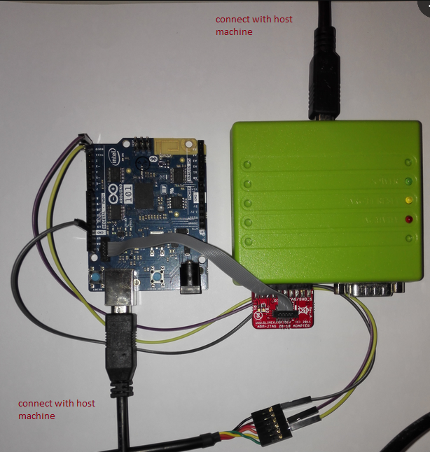

### About Curie BSP port
[Intel® Curie BSP](https://github.com/CurieBSP/main/blob/master/README.rst) is the SDK that will help you developing software on Curie based boards, for example with the [Arduino 101 board (AKA Genuino 101)](https://www.arduino.cc/en/Main/ArduinoBoard101).

This folder contains necessary files to integrate JerryScript with Intel® Curie BSP, so that JavaScript can run on Arduino 101 board (AKA Genuino 101).

### How to build
#### 1. Preface

Curie BSP only support Ubuntu GNU/Linux as host OS envirenment.

Necessary hardwares
* [FlySwatter2 JTAG debugger](https://www.tincantools.com/wiki/Flyswatter2)
* [ARM-JTAG-20-10](https://www.amazon.com/PACK-ARM-JTAG-20-10-Micro-JTAG-adapter/dp/B010ATK9OC/ref=sr_1_1?ie=UTF8&qid=1469635131&sr=8-1&keywords=ARM+Micro+JTAG+Connector)
* [USB to TTL Serial Cable](https://www.adafruit.com/products/954)

#### 2. Prepare Curie BSP

You can refer to a detailed document [Curie BSP](https://github.com/CurieBSP/main/releases). But, we summary the main steps below:

##### 1. Get repo:
```
mkdir ~/bin
wget http://commondatastorage.googleapis.com/git-repo-downloads/repo -O ~/bin/repo
chmod a+x ~/bin/repo
```

##### 2. In ``~/.bashrc`` add:
```
PATH=$PATH:~/bin
```

##### 3. Create your directory for CurieBSP (eg. Curie_BSP):
```
mkdir Curie_BSP && cd $_
```

##### 4. Initialize your repo:
```
repo init -u https://github.com/CurieBSP/manifest
```

##### 5. Download the sources files:
```
repo sync -j 5 -d
```

##### 6. Get toolchain (compilation/debug):
Download [issm-toolchain-linux-2016-05-12.tar.gz](https://software.intel.com/en-us/articles/issm-toolchain-only-download), and uncompress it.
**TOOLCHAIN_DIR** environment variable needs to match the toolchain destination folder
You can use the command:``export TOOLCHAIN_DIR='path to files of the toolchain'``

Or you can just uncompress the toolchain tarball and copy the contents (`licensing readme.txt tools  version.txt`) into `wearable_device_sw/external/toolchain`.

##### 7. Get BLE firmware:
Download [curie-ble-v3.1.1.tar.gz]( https://registrationcenter.intel.com/en/forms/?productid=2783) and uncompress the retrieved package into ``wearable_device_sw/packages`` folder

You will first register in the web page. Then you will receive an email where is a download link. Click the link in the mail, choose the `curie-ble-v3.1.1.tar.gz (118 KB)` and download.

##### 8. Get tools to flash the device:
[https://01.org/android-ia/downloads/intel-platform-flash-tool-lite](https://01.org/android-ia/downloads/intel-platform-flash-tool-lite)


#### 3. Build JerryScript and Curie BSP
##### 1. Generate makefiles
Run the Python script ``setup.py`` in ``jerryscript/targets/curie_bsp/`` with the full path or relative path of the ``Curie_BSP``:
```
python setup.py <path of Curie_BSP>
```

##### 2. One time setup. It will check/download/install the necessary tools, and must be run only once.
In the directory ``Curie_BSP``
```
make -C wearable_device_sw/projects/curie_bsp_jerry/ one_time_setup
```

##### 3. In the directory ``Curie_BSP``
```
mkdir out && cd $_
make -f ../wearable_device_sw/projects/curie_bsp_jerry/Makefile setup
make image
```

##### 4. Connect JTAG Debugger and TTL Serial Cable to Arduino 101 as below:


##### 5. Flash the firmware
```
make flash FLASH_CONFIG=jtag_full
```


#### 4. Serial terminal
Assume the serial port is ``ttyUSB0`` in ``/dev`` directory, we can type command ``screen ttyUSB0 115200`` to open a serial terminal.

After the board boot successfully, you should see something like this:
```
Quark SE ID 16 Rev 0 A0
ARC Core state: 0000400
BOOT TARGET: 0
  6135|QRK| CFW| INFO| GPIO service init in progress..
  6307|ARC|MAIN| INFO| BSP init done
  6315|ARC| CFW| INFO| ADC service init in progress..
  6315|ARC| CFW| INFO| GPIO service init in progress...
  6315|ARC| CFW| INFO| GPIO service init in progress...
  6315|ARC|MAIN| INFO| CFW init done
```
To test the JavaScript command, you should add characters ``js e `` to the beginning of the JavaScript command, like this:
``js e print ('Hello World!');``

It is the uart command format of Curie BSP. `js` is cmd group, `e` is cmd name, which is short for eval,  and `print ('Hello World!');` is the cmd parameters, which is the JavaScript code we want to run.

You can see the result through the screen:
```
js e print ('Hello World!');js e 1 ACK
Hello World!
undefined
js e 1 OK
```

`js e 1 ACK` and `js e 1 OK` are debug info of Curie BSP uart commands, which mean it receive and execute the command sucessfully. `Hello World!` is the printed content. `undefined` is the return value of the statement `print ('Hello World!')`.
